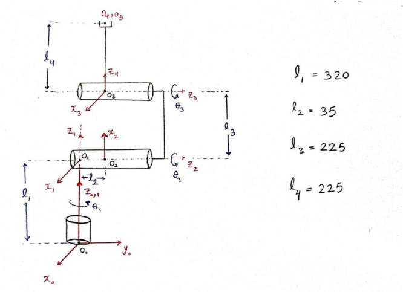
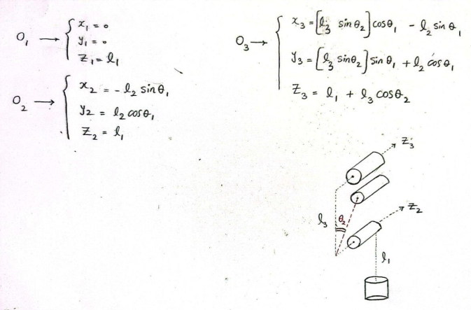
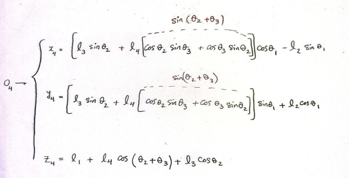

# Analysis-simulation-and-control-of-a-6-DOF-robot
Analysis, simulation and control of a six-degree-of-freedom robot

## Design of robot in SolidWorks
---
- Design and Simulation of robot using SolidWorks
<p align="center">
   
</p>

---
- Classic & Modified Denavit-Hartenberg Parameter Table
<p align="Left">
   
   
</p>
--- 
## Design of robot in SolidWorks

---
- Calculating D,C and G Dynamic Matrices for Robot

```math
D(q)=\sum_{i=1}^n\left(m_i * J_{v_i}(q)^T * J_{v_i}(q)+J_{w_i}(q)^T * R_i(q) * I_i * R_i(q)^T * J_{w_i}(q)\right)
```

```math
C_{i j k}=\frac{1}{2}\left\{\frac{\partial d_{k j}}{\partial q_i}+\frac{\partial d_{k i}}{\partial q_j}-\frac{\partial d_{i j}}{\partial q_k}\right\}
```

```math
\begin{aligned}
&P=m_i * g * h_i\\
&G=\left[\begin{array}{c}
\frac{\partial P}{\partial q_1} \\
\frac{\partial P}{\partial q_2} \\
\cdot \\
\cdot
\end{array}\right]
\end{aligned}
```

---


<p align="center">
   
   
</p>
<p align="center">
   
</p>
---
## Contributers
<table>
  <tr>
    <td align="center">
      <a href="https://github.com/Sajad-Ghadiri">
        <br>
        <sub>
          <b>Sajad Ghadiri</b>
        </sub>
      </a>
    </td>
    <td align="center">
      <a href="https://github.com/MBW0lf">
        <br>
        <sub>
          <b>Mohammad Barabadi</b>
        </sub>
      </a>
    </td>
</table>