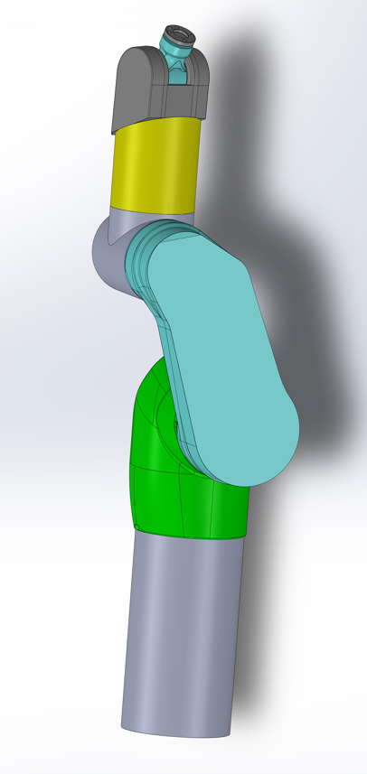
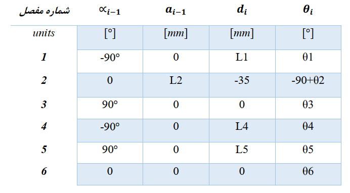
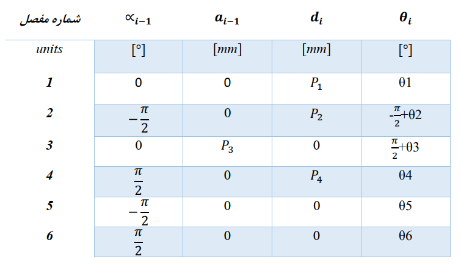

# Analysis-simulation-and-control-of-a-6-DOF-robot
Analysis, simulation and control of a six-degree-of-freedom robot

## Design of robot in SolidWorks
---
- Design and Simulation of robot using SolidWorks

   

---
- Classic & Modified Denavit-Hartenberg Parameter Table

   
   

---
Denavit-Hartenberg Parameter Tables

## Contributers
<table>
  <tr>
    <td align="center">
      <a href="https://github.com/Sajad-Ghadiri">
         
        
          <b>Sajad Ghadiri</b>
        
      </a>
    </td>
    <td align="center">
      <a href="https://github.com/MBW0lf">
         
        
          <b>Mohammad Barabadi</b>
        
      </a>
    </td>
</table>